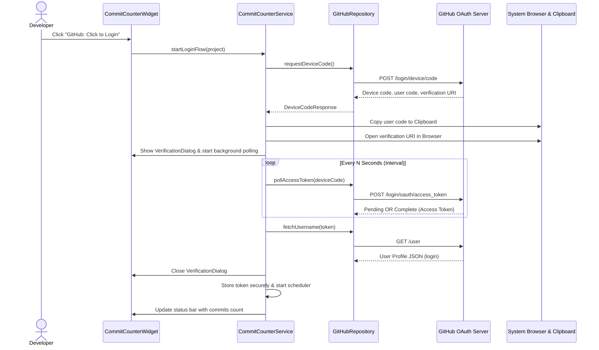
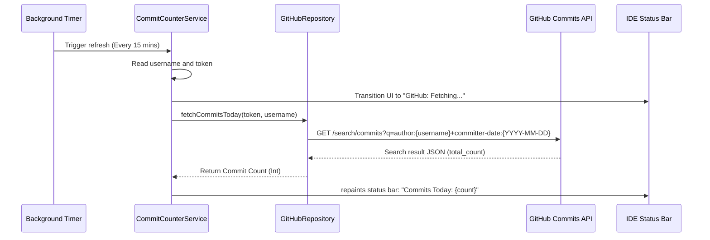

# 📊 CommitCounter - IntelliJ Platform Plugin 🚀

[]()
[]()
[]()
[]()
[]()

An elegant, highly robust, and lightweight **IntelliJ Platform Plugin** designed to keep developers motivated by displaying their real-time daily GitHub commit counts directly inside the IDE's **Status Bar** (`StatusBarWidget`). 

Built meticulously using **Clean Architecture** principles, strict **SOLID design patterns**, and adhering strictly to the JetBrains SDK guidelines.

---

## 🎨 Visual Preview & Status UI States

The status bar widget dynamically transitions between states based on authentication status, synchronization events, and network conditions:

| State | Status Bar Representation | Tooltip Description | User Action (On Click) |
| :--- | :--- | :--- | :--- |
| **Logged Out** 🚪 | `GitHub: Click to Login` | *Click to authenticate with GitHub.* | Launches secure OAuth Device Flow. 🔑 |
| **Synchronizing** 🔄 | `GitHub: Fetching...` | *GitHub: Synchronizing commits...* | Displays loader, prevents duplicate sync calls. |
| **Authenticated** ✅ | `Commits Today: [Count]` | *Logged in as {username}. Click for options.* | Opens the Interactive Actions Menu. ⚙️ |
| **Error / Offline** ⚠️ | `GitHub: Error` | *GitHub Error: {Error Message}. Click to retry.* | Relaunches the authentication flow. |

---

## 🚀 Key Features & Advanced Capabilities

- 📍 **Native Integration:** Sits perfectly at the bottom-right corner of the IDE Status Bar (aligned with VCS, file encoding, and line indicators).
- 🔑 **Secure GitHub OAuth Device Flow:** Sign in securely without typing or pasting raw passwords or Personal Access Tokens (PAT) directly into the IDE.
- 🔒 **Enterprise-Grade Credential Protection:** Integrates with JetBrains' native `PasswordSafe` and `CredentialAttributes` API, persisting tokens in OS-native secure keychains (macOS Keychain, Windows Credential Manager, or Linux Libsecret).
- 🕒 **Smart Background Syncing:** Automates count checks every 15 minutes utilizing JVM-optimized scheduling thread pools without overhead.
- ⚡ **Asynchronous & Thread-Safe:** Completely isolates network queries, JSON mapping, and file reads to background pool workers, guaranteeing a **0-lag/0-freeze UI experience**.
- 🖱️ **Contextual Actions Menu:** Instantly trigger manual data refreshes, initiate safe logouts, or close popup frames via a clean JetBrains `JBPopup` list.

---

## 🏗️ Architectural Pattern (Clean Architecture)

This project strictly splits the application responsibilities into decoupled layers, separating presentation elements, business rules, and external data sources:

```
src/main/kotlin/com/vahitkeskin/commitcounter/
├── 📂 data/
│   └── 📂 repository/
│       ├── 📄 GitHubRepository.kt       # Outer infrastructure logic for networking & API processing
│       └── 📄 PasswordSafeStorage.kt    # Low-level persistence mapping (Credentials & properties)
├── 📂 domain/
│   ├── 📂 model/
│   │   └── 📄 CommitState.kt            # High-level state models detailing application status
│   └── 📂 usecase/
│       └── 📄 CommitCounterService.kt   # Core application logic, scheduler, flow coordinator
└── 📂 presentation/
    └── 📂 widget/
        ├── 📄 CommitCounterWidget.kt    # Renders the text widget and captures mouse operations
        ├── 📄 CommitCounterWidgetFactory.kt # Registers the widget into the IDE ecosystem
        └── 📄 VerificationDialog.kt     # Swing dialog rendering the code-verification screen
```

---

## 🔄 Detailed Process Flows

### 1. GitHub OAuth Device Authorization Flow 🔑


### 2. Daily Commit Calculation Flow 📊


---

## 🛠️ Codebase & Component Breakdown

### 📂 Data Layer
- **`PasswordSafeStorage.kt`**
  - Interacts with `com.intellij.ide.passwordSafe.PasswordSafe` to save and delete the access token.
  - Interacts with `com.intellij.ide.util.PropertiesComponent` to persist non-sensitive user metadata like the GitHub username.
- **`GitHubRepository.kt`**
  - Manages HTTP REST requests using `java.net.http.HttpClient`.
  - Parses JSON response nodes safely using `com.google.gson.Gson`.
  - Configures crucial headers (`User-Agent` and custom `Accept` API versions) required by GitHub.

### 📂 Domain Layer
- **`CommitState.kt`**
  - Implements a Kotlin `sealed class` mapping the distinct presentation states: `LoggedOut`, `Fetching`, `LoggedIn(username, count)`, and `Error(message)`.
- **`CommitCounterService.kt`**
  - Application-level service (marked with `@Service(Service.Level.APP)`).
  - Maintains state and schedules periodic commit fetches using `AppExecutorUtil.getAppScheduledExecutorService()`.
  - Handles the background threads via pooled task executors to guarantee zero main-thread blockages.

### 📂 Presentation Layer
- **`CommitCounterWidgetFactory.kt`**
  - Implements `StatusBarWidgetFactory`, declaring the widget presence in the IntelliJ IDE status bar.
- **`CommitCounterWidget.kt`**
  - Handles rendering of status bar labels, tooltip formatting, and registers clicks.
  - Builds the action menu popup using IntelliJ's `JBPopupFactory` with actions: `Yenile (Refresh)`, `Çıkış Yap (Logout)`, `İptal`.
- **`VerificationDialog.kt`**
  - Renders custom instructions using basic HTML styling within Swing components, ensuring compatibility across different IDE themes (Darcula, IntelliJ Light, etc.).

---

## ⚙️ How to Configure GitHub OAuth Credentials

To deploy this plugin with your custom application registration details:

1. Go to **[GitHub Developer Settings](https://github.com/settings/developers)** -> **OAuth Apps** -> **Register a new application**.
2. Fill in the app details. Ensure the checkmark for **Enable Device Flow** is set to true.
3. Once registered, copy the **Client ID**.
4. Set the constant `CLIENT_ID` in [GitHubRepository.kt](src/main/kotlin/com/vahitkeskin/commitcounter/data/repository/GitHubRepository.kt):
   ```kotlin
   private const val CLIENT_ID = "YOUR_CLIENT_ID"
   ```

---

## 🛠️ Local Development & Build Orchestrations

### 🏁 Standard Build Tasks
Build, compile, and package the plugin using the gradle wrapper scripts:

* **Compile Code & Resources:**
  ```bash
  ./gradlew compileKotlin
  ```
* **Verify Configurations:**
  ```bash
  ./gradlew verifyPlugin
  ```
* **Assemble Distributable Bundle:**
  ```bash
  ./gradlew buildPlugin
  ```
  The packaged plugin `.zip` will be outputted to: `build/distributions/CommitCounter-1.0-SNAPSHOT.zip`.

* **Launch Test Sandbox IDE Instance:**
  ```bash
  ./gradlew runIde
  ```

---

## 🔧 Deep-Dive Troubleshooting Guide

#### 🔴 The Status Bar Displays "GitHub: Error"
- **Cause 1:** Invalid or expired OAuth Token.
  - *Fix:* Click the widget, select **Çıkış Yap (Logout)**, and click again to login and generate a new token.
- **Cause 2:** Network unreachable or DNS issues.
  - *Fix:* Verify your internet connection. Eklenti will automatically re-attempt synchronization every 15 minutes.
- **Cause 3:** GitHub API rate limits.
  - *Fix:* The search endpoint has specific rate limit thresholds. Wait a few minutes and run a manual **Refresh**.

#### 🟡 The Verification Browser Window Fails to Open
- **Cause:** Defunct default system browser configuration on host OS.
  - *Fix:* The verification code has been automatically copied to your clipboard. Simply open your browser manually, navigate to `https://github.com/login/device`, and paste the code.

#### 🟢 Logs location for debugging
To view IDE and plugin logs for detailed diagnosis, refer to the JetBrains standard log directory or view it from the running sandbox terminal.

---

## 📄 License & Collaboration

- This project is licensed under the **MIT License**.
- Pull Requests, bug reports, and features proposals are welcomed! Feel free to fork the repository and contribute. 💖
